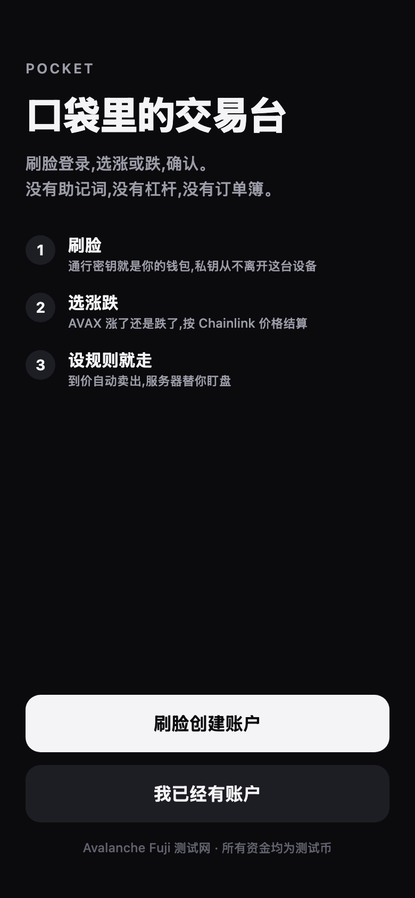
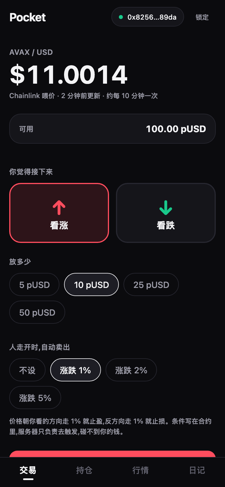
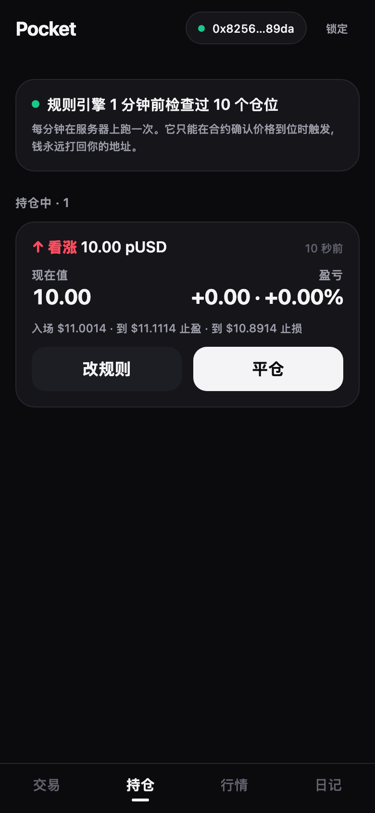
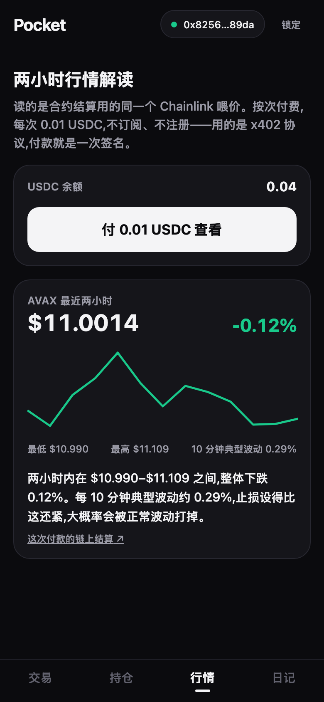
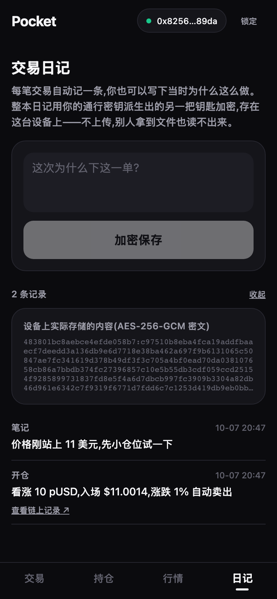
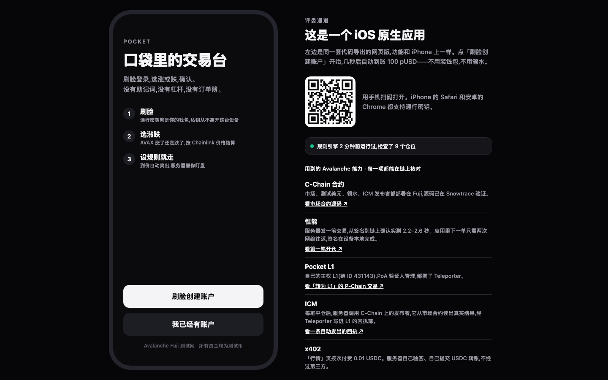

# Pocket

Pocket 是一个运行在 Avalanche 上的移动端交易应用。用户通过通行密钥(Face ID、Touch ID 或设备密码)登录,选择看涨或看跌和金额后下单,也可以设置止盈止损,由服务端在条件满足时代为执行。

Avalanche 上现有的交易类应用以网页为主。Pocket 是一个 iOS 应用,基于 Expo(React Native)开发,同一套代码也导出为网页版。项目还包括 Fuji C-Chain 上的合约、一个 Cloudflare Worker 服务端,以及一条自建的 Avalanche L1。

在线体验:https://pocket.photogif.workers.dev

演示视频:https://youtu.be/f7TgC0h_NZw (1 分 49 秒,网页版录屏;仓库内副本 [docs/pocket-demo.mp4](docs/pocket-demo.mp4))

幻灯片:[docs/pocket-slides.pdf](docs/pocket-slides.pdf)

| 登录 | 交易 | 持仓 | 行情(x402) | 日记 |
|---|---|---|---|---|
|  |  |  |  |  |

## 体验

1. 打开 https://pocket.photogif.workers.dev ,点击「刷脸创建账户」,按系统提示完成验证。iPhone 上是面容 ID;Mac 上是 Touch ID,没有 Touch ID 的 Mac 会要求输入电脑的登录密码。
2. 新账户会自动收到 100 pUSD(测试用美元)、少量 AVAX 手续费和 0.05 USDC,一般几秒内到账。
3. 在「交易」页选择看涨或看跌和金额,确认后交易上链。页面底部的提示可以跳转到 Snowtrace 查看交易。
4. 「持仓」页显示当前盈亏,可以平仓或修改止盈止损。
5. 「行情」页可以支付 0.01 USDC 查看最近两小时的行情分析(x402)。
6. 「日记」页记录每笔交易,内容在设备上加密保存。

锁定后重新验证,会回到同一个地址。

在桌面浏览器中打开时,右侧会列出各项功能对应的链上记录:



如果通行密钥保存在 Google 密码管理工具中(在 Chrome 里创建,或在 iPhone 的「自动填充与密码」里选了 Chrome),系统还会要求设置或输入 Google 密码管理工具的 PIN,这一步需要能访问 Google 服务。在中国大陆建议使用 iCloud 钥匙串(Safari 默认),或者选择下面的演示账户。

如果浏览器中的通行密钥不支持 PRF 扩展,或者验证被取消,可以选择「用演示账户继续」。演示账户的密钥保存在当前浏览器中,其余功能相同。

所有资金均为 Fuji 测试网上的测试代币。

## 验证记录

2026-10-07 在真实环境中完成了一次完整流程,使用 Mac 上的 Chrome 154,通行密钥保存在 Google 密码管理工具中,用电脑登录密码完成验证。

| 步骤 | 结果 |
|---|---|
| 创建账户 | 通过通行密钥 PRF 派生出账户 `0x40d5…f39c`,自动收到启动资金([交易](https://testnet.snowtrace.io/tx/0x521a044bad6b58f67ee500237016f89f86560b26abcd07d601201f5f36834c51)) |
| 下单 | 11 号仓位,看跌 10 pUSD,开仓价 $11.1634,在设备上签名后一笔交易上链 |
| x402 付费查看行情 | 账户 USDC 余额从 0.05 变为 0.04 |
| 行情数据 | 页面显示最新价 $11.1634、最低 $10.985、最高 $11.213、涨幅 +1.22%、10 分钟典型波动 0.42%。直接读取 Chainlink AVAX/USD 喂价合约最近 13 次更新重新计算,五项结果一致 |

其他已测试的环境:

- iOS 模拟器(iPhone 17 Pro,原生 Release 构建):系统通行密钥面板正常弹出(关联域名验证通过),完成创建账户、开仓、平仓;平仓后服务端自动发布 ICM 回执([交易](https://testnet.snowtrace.io/tx/0xe63f9b8825a2274f7bcf301bf70253f0246ebee2e0e5603d0862ff7b21a27c13)),中继器将其送达 Pocket L1,回执簿中的记录与市场合约一致。
- Chromium 与 Chrome 虚拟认证器(手机和电脑两种宽度):完整流程通过;锁定后重新验证回到同一地址,加密日记可以解密。认证器不支持 PRF 时,页面提供演示账户,演示账户同样可以完成领取、下单和锁定后找回。

## 功能

- **通行密钥账户**:通过 WebAuthn PRF 扩展获得 32 字节输出,再用 HKDF 分别派生交易私钥(secp256k1)和日记加密密钥。私钥只存在于内存中,不写入存储。基于 [mera](https://github.com/category-labs/mera)。
- **一笔交易开仓**:EIP-2612 permit 签名随开仓交易一起提交,新用户不需要单独授权。
- **链上止盈止损**:触发条件保存在合约中。任何人都可以调用执行,但只有 Chainlink 价格满足条件时才会成功,结算款只会转给仓位所有者。服务端每分钟检查一次。
- **新用户启动资金**:领水合约对每个地址只发放一次。
- **x402 按次付费**:服务端内置结算逻辑,验证 EIP-3009 签名后自行提交 USDC 转账。
- **ICM 成交回执**:仓位平仓后,C-Chain 上的 ReceiptPublisher 从市场合约读取结算结果,通过 Teleporter 发送到 Pocket L1 上的 ReceiptBook。回执内容来自合约状态,而不是调用方参数。

## 架构

```
iPhone / 浏览器
  │  通行密钥(WebAuthn PRF)→ HKDF
  │     ├─ 交易私钥(secp256k1,仅在内存中)
  │     └─ 日记密钥(AES-256-GCM)
  │
  ├─▶ Fuji C-Chain
  │     PocketMarket      开仓(permit + open)、平仓、止盈止损
  │     PocketFaucet      新用户启动资金
  │     ReceiptPublisher  平仓回执 ──ICM──▶ Pocket L1 / ReceiptBook
  │
  └─▶ Cloudflare Worker(pocket.photogif.workers.dev)
        POST /api/drip     调用领水合约
        GET  /api/insight  x402 付费接口(0.01 USDC)
        cron(每分钟)      执行到价的止盈止损;为已平仓仓位发布回执
        静态资源            网页版
```

价格来自 Chainlink AVAX/USD(Fuji),约每 10 分钟更新一次。

服务端从签名到交易确认实测为 2.2–2.6 秒。应用在设备上签名交易,并预先设定 gas 上限和手续费上限,下单只需两次网络请求(获取 nonce、广播交易)。

## 目录结构

```
contracts/   Foundry 项目:合约、测试、部署脚本
server/      Cloudflare Worker:领水、止盈止损执行、x402、网页托管
app/         Expo 应用(iOS 与网页)
config/      部署地址,三端共用(fuji.json、pocket-l1.json)
ops/         Pocket L1 节点与 ICM 中继器的启动脚本
docs/        提交材料与截图
```

## 部署信息

### Fuji C-Chain

以下合约均已在 Snowtrace 验证源码。

| 合约 | 地址 |
|---|---|
| PocketMarket | [`0x81d00d6A3b9bdCE2e5C70dd2C7f11E4E30631012`](https://testnet.snowtrace.io/address/0x81d00d6A3b9bdCE2e5C70dd2C7f11E4E30631012) |
| PocketUSD (pUSD) | [`0x176bF1378f945035fe64Ed3efc44d3Ad737F415a`](https://testnet.snowtrace.io/address/0x176bF1378f945035fe64Ed3efc44d3Ad737F415a) |
| ChainlinkPriceSource | [`0xd018ED0cd4b961562346bb5814FDa0A7ef9eA8B8`](https://testnet.snowtrace.io/address/0xd018ED0cd4b961562346bb5814FDa0A7ef9eA8B8) |
| PocketFaucet | [`0xef0CB3769F111c3Ca9D17CE8499EE7451E6DE2e1`](https://testnet.snowtrace.io/address/0xef0CB3769F111c3Ca9D17CE8499EE7451E6DE2e1) |
| ReceiptPublisher | [`0x69D5BD3f8B53f6C6c7679AF9703a015b4Db5F2f7`](https://testnet.snowtrace.io/address/0x69D5BD3f8B53f6C6c7679AF9703a015b4Db5F2f7) |
| TeleporterMessenger(官方部署) | [`0x253b2784c75e510dD0fF1da844684a1aC0aa5fcf`](https://testnet.snowtrace.io/address/0x253b2784c75e510dD0fF1da844684a1aC0aa5fcf) |

### Pocket L1

| 项 | 值 |
|---|---|
| 链 ID | 431143(原生代币 PKT) |
| Subnet ID | `sqZfDfuLVQJLegqCceBny5eXChRASJxA5d4d3sfJ5MoqxSMUT` |
| Blockchain ID | `oakJiv5A35aNYD2MRcN8qYUwB3hTya8sohR8BTgUduDb6NKiK` |
| ConvertSubnetToL1Tx | [`2u8T3XUU…1QBAn`](https://build.avax.network/explorer/fuji/p-chain/tx/2u8T3XUUvqXXkuiDyitsEzJfnfpsJPMiFwV78qHFZjypJ1QBAn) |
| 验证人管理 | Proof of Authority |
| TeleporterMessenger | `0x253b2784c75e510dD0fF1da844684a1aC0aa5fcf` |
| ReceiptBook | `0xa34AA4Fe1f6811b478719C64c67F1b7ef08817D2` |

### 链上记录

| 内容 | 交易 |
|---|---|
| 开仓(permit + open,一笔交易) | [`0xe512029d…ffbb7f`](https://testnet.snowtrace.io/tx/0xe512029daeb107141257637df61150965a0fa2baead30e527d3fa686f4ffbb7f) |
| 新用户领取启动资金 | [`0xc83e4fd1…918e64`](https://testnet.snowtrace.io/tx/0xc83e4fd12383731814c1164e45cf2a1b4e082330dc3bf42d6ab1a1cdf3918e64) |
| x402 付款结算 | [`0x58952c2b…1f2223`](https://testnet.snowtrace.io/tx/0x58952c2b83c51c60a923f61161f743d2a8441e489ad92342f931ac0e531f2223) |
| 服务端自动发布的 ICM 回执 | [`0xe63f9b88…a27c13`](https://testnet.snowtrace.io/tx/0xe63f9b8825a2274f7bcf301bf70253f0246ebee2e0e5603d0862ff7b21a27c13) |
| 回执在 L1 上记账 | L1 区块 12,交易 `0x210eb78e4516b1e7490de744be670cc777003c799d3dc9b122e0121d9a4121c0` |

## 本地开发

### 环境要求

- Node.js 20 或更高版本
- [Foundry](https://getfoundry.sh)
- Xcode 26 和 CocoaPods(构建 iOS 应用时需要)
- Cloudflare 账号(部署服务端时需要)
- [Avalanche CLI](https://github.com/ava-labs/avalanche-cli)(运行 Pocket L1 时需要)

环境变量见 [`.env.example`](.env.example)。

### 合约

```bash
cd contracts
forge test
```

共 28 个测试,其中包括 512 轮的资金池偿付能力模糊测试。部署脚本在 `contracts/script/` 下,部署结果写入 `config/fuji.json`。

### 服务端

```bash
cd server
npm install
npx wrangler secret put EXECUTOR_PRIVATE_KEY
npx wrangler dev
```

### 应用

```bash
cd app
npm install
npx expo start --web    # 网页版
npx expo run:ios        # iOS
```

iOS 上的通行密钥需要 iOS 18 或更高版本,并依赖关联域名 `webcredentials:pocket.photogif.workers.dev`。原生构建需要在不含空格的路径下进行,因为 `expo-constants` 的构建脚本不支持含空格的路径。

### Pocket L1

```bash
./ops/l1-up.sh
```

该脚本启动本地验证节点和 C-Chain 到 Pocket L1 的 ICM 中继器。中继器配置由 `ops/relayer-config.py` 根据 `.env` 生成;中继器在连接中断退出后会自动重启,并补发离线期间的消息。

Avalanche CLI 1.9.6 默认安装的 avalanchego 1.14 和 subnet-evm 0.8.0 无法连接当前的 Fuji 网络。本项目使用 avalanchego 1.15.1 及其发布包中的 subnet-evm;签名聚合器 0.6.0 和 icm-relayer 1.8.2 由 `ava-labs/icm-services` 源码编译,因为这两个版本没有提供 macOS 构建。

## 安全

- 部署密钥(合约所有者)不在服务端。服务端只持有执行器密钥,用于支付 gas、调用领水合约和执行止盈止损。
- 执行器无法转移用户资金。止盈止损由合约校验价格条件,结算款只发给仓位所有者。
- 资金池按每个仓位保证金的 2 倍预留,保证在任意价格下都能全额结算。
- 领水合约对每个地址只发放一次;领水接口对同一 IP 每小时最多响应 10 次。

## 已知限制

- 仅部署在测试网,pUSD 为测试代币。
- Chainlink 在 Fuji 上约每 10 分钟更新一次价格,在价格更新前开仓存在套利空间。价格源在合约中是可替换的接口。
- Pocket L1 的验证节点和 ICM 中继器运行在开发者的电脑上。电脑休眠期间,回执会延迟送达但不会丢失。L1 的 RPC 没有对公网开放,应用中显示的是 C-Chain 一侧的发送状态。
- 演示账户的密钥保存在浏览器本地存储中,仅用于在不支持 PRF 的浏览器上体验。
- 按照 App Store 审核指南 3.1.5(b),加密货币交易应用需要由持牌金融机构发布,因此 iOS 版本通过 TestFlight 分发。

## 关于本项目

本项目为 Avalanche Buildathon(Team1 China)参赛作品,方向为「消费应用与支付」。仓库中的全部代码均在比赛期间编写,可通过提交历史查看。
